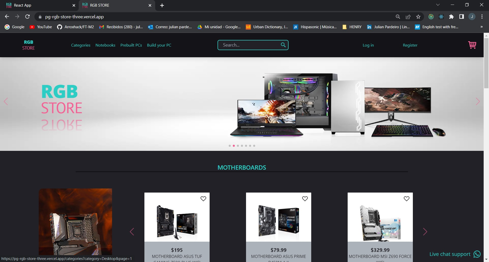

<!-- ### Hi there 👋 -->

<!--
**Arroxhack/Arroxhack** is a ✨ _special_ ✨ repository because its `README.md` (this file) appears on your GitHub profile.

Here are some ideas to get you started:

- 🔭 I’m currently working on ...
- 🌱 I’m currently learning ...
- 👯 I’m looking to collaborate on ...
- 🤔 I’m looking for help with ...
- 💬 Ask me about ...
- 📫 How to reach me: ...
- 😄 Pronouns: ...
- ⚡ Fun fact: ...
-->

<h1 align='center'>Bienvenidos a mi perfil de GitHub, soy Julian Pardeiro!</h1>

<h2 align="center">Full Stack Developer 💻</h2>

<h3 align="center">Mi nombre es Julián Pardeiro, me apasiona programar, la música, la enseñanza y el aprendizaje constante.
Soy muy competitivo y curioso buscando constantemente el desarrollo personal y de quienes me rodean.</h3> 

<h1 align="center">Mis skills</h1>

    
 

    

 
 

 <h1 align="center">Mis proyectos</h1>
 

 
 
 

 
 <h1 align="center">Contacto</h1>

